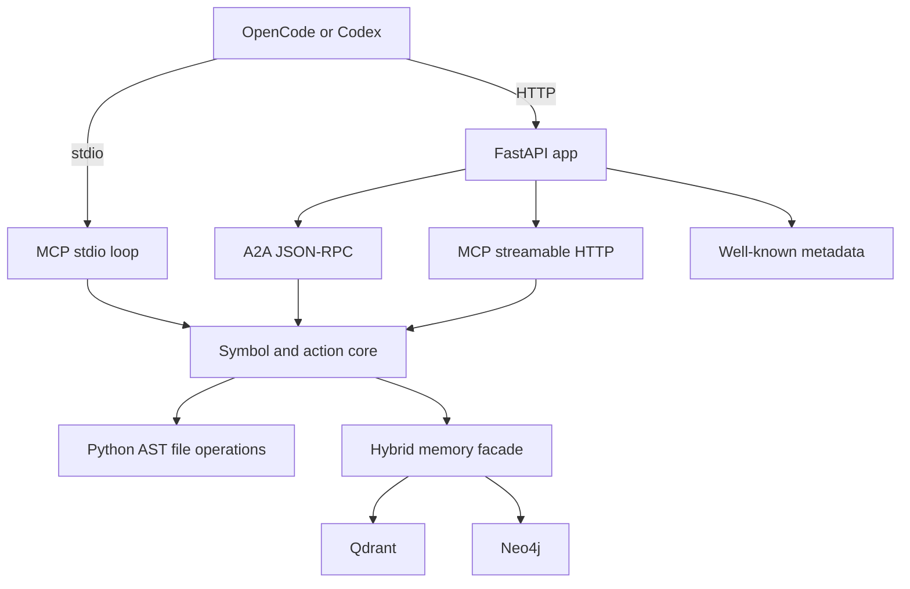

# Simone MCP Architecture

## Summary

Simone MCP uses a Python-first architecture with two transport modes:

1. stdio for local MCP clients
2. streamable HTTP for remote MCP and A2A-facing deployments

The implementation is intentionally split so symbol logic stays importable without requiring the HTTP stack during local tests.

## Current runtime layout

## Why this shape

### Dual transport

The MCP spec in production has converged on streamable HTTP for remote servers, but local clients still benefit from stdio. Simone ships both.

### Python source of truth

The previous repo state contained only compiled JavaScript stubs. The repo now has an actual Python implementation under `src/`.

### Security posture

The HTTP transport validates `Origin` and can require Bearer tokens backed by JWKS validation when OAuth is enabled.

## Transport details

### stdio

`python3 src/cli.py serve-mcp`

Supported methods:

- `initialize`
- `ping`
- `tools/list`
- `tools/call`
- `resources/list`
- `prompts/list`

### streamable HTTP

`python3 src/cli.py serve`

Endpoint:

- `GET|POST|DELETE /mcp`

Implemented behavior:

- `initialize` returns protocol/version metadata and a session id
- `tools/list` returns the tool registry
- `tools/call` executes the action surface
- `GET /mcp` opens an SSE-compatible event stream response
- `DELETE /mcp` accepts explicit session shutdown

## Action surface

The current implementation provides:

- symbol lookup
- textual reference search
- Python function body replacement
- insertion after a Python symbol block
- workspace overview
- health and help actions
- hybrid memory query facade

## Memory strategy

Simone uses a hybrid memory contract:

- Qdrant for vector recall
- Neo4j for relationship-aware expansion

The current repo implements the integration surface and configuration contract first, while keeping the query path safe when those backends are not configured.

## A2A surface

`POST /a2a/v1`

Implemented methods:

- `agent/getCard`
- `message/send`

The A2A layer translates incoming actions into the same core execution surface used by MCP.

## Metadata surface

Simone publishes:

- `/.well-known/agent-card.json`
- `/.well-known/agent.json`
- `/.well-known/oauth-client.json`
- `/.well-known/oauth-authorization-server`

## Deployment model

### Local

- editable install
- pytest verification
- stdio MCP integration via `mcp-config.json`

### Container

- single Docker image
- uv-based install path
- docker-compose stack with Qdrant and Neo4j

### Hugging Face Spaces

Use Spaces as compute and UI. Keep durable state in external systems or mounted storage rather than assuming local filesystem persistence.

## Validation targets

- `pytest tests/ -v`
- `python3 src/cli.py print-card`
- `python3 src/cli.py run-action '{"action":"simone.mcp.health"}'`
- stdio initialize/tools flow
- HTTP health and metadata endpoints