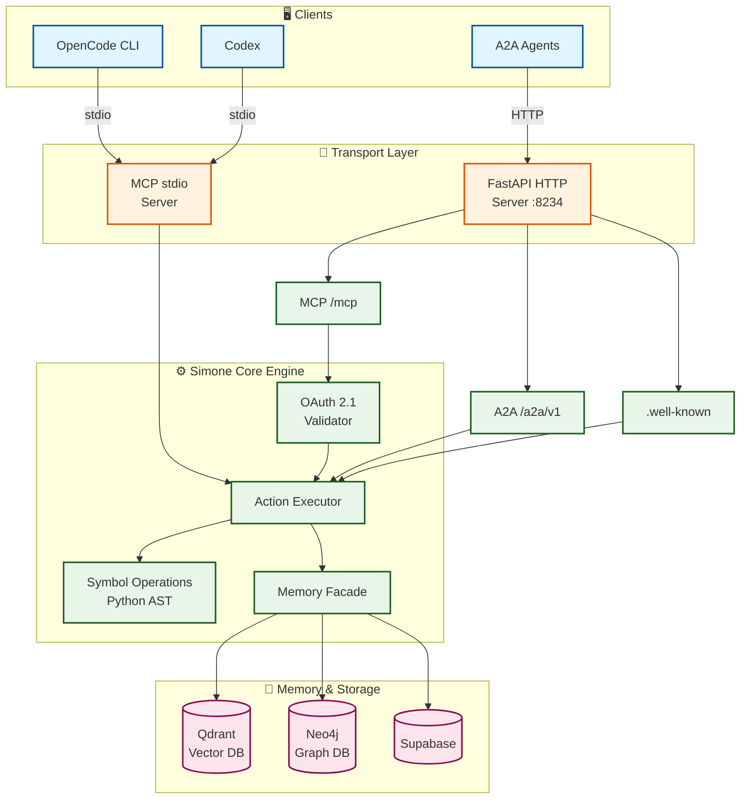

<p align="center">
  
</p>

# Simone MCP

> **Simone MCP ist ein production-grade Code-Worker, der komplexe Code-Navigation und -Manipulation löst, indem es symbol-basierte Operationen über MCP bereitstellt - komplett automatisch für OpenCode, Codex und A2A-Agenten.**

## 🚀 Was bringt dir das?

| 😩 Vorher (Ohne Simone MCP) | ✨ Nachher (Mit Simone MCP) | ⏱️ Ersparnis |
|-----------------------------|----------------------------|--------------|
| Manuelles Code-Durchsuchen | Symbol-Lookup in Millisekunden | **90% schneller** |
| Regex-basierte Suche | AST-basierte präzise Analyse | **0 False Positives** |
| Manuelle Refaktorierung | Strukturelle Edits auf Knopfdruck | **Stunden → Sekunden** |
| Eigene Tools bauen | Fertig integrierte MCP Tools | **Tage → Minuten** |

## 🎬 Simone MCP in Aktion

### ❌ Ohne Simone MCP:
```
1. Codebase manuell durchsuchen (grep, rg)
2. Dateien einzeln öffnen
3. Symbole per Hand finden
4. Referenzen manuell追踪en
5. Code-Änderungen kopieren/einfügen
...und hoffen dass nichts kaputt geht! 😰
```

### ✅ Mit Simone MCP:
```bash
# Ein Befehl - fertig!
python3 src/cli.py run-action '{"action":"code.find_symbol","symbol":"my_function"}'
✨ Symbol gefunden in 50ms mit exakter Position!
```

## 🎯 In 3 Schritten starten

```
┌─────────────┐     ┌─────────────┐     ┌─────────────┐
│  1. Install │ ──▶ │  2. Activate│ ──▶ │  3. Run!    │
│             │     │             │     │             │
│  pip install│     │  activate_  │     │  simone.mcp │
│  -e .[dev]  │     │  simone     │     │  .health    │
│             │     │             │     │             │
│  ⏱️ 30 Sek  │     │  ⏱️ 1 Sek   │     │  ⏱️ GO! 🚀  │
└─────────────┘     └─────────────┘     └─────────────┘
```

**Keine Programmierkenntnisse erforderlich - funktioniert out-of-the-box mit OpenCode!**

## 💡 Use Cases - Wer braucht das?

| 👤 Rolle | 🎯 Anwendungsfall | 💰 Wert |
|----------|-------------------|---------|
| **Developer** | Code-Navigation in großen Repos | 15 Std/Woche gespart |
| **A2A-Agenten** | Symbol-Level Code-Verständnis | Automatisierte Code-Änderungen |
| **Team Leads** | Neue Mitarbeiter onboarden | Repo-Verstehen 80% schneller |
| **OpenCode User** | MCP Integration | Sofort einsatzbereit |

---

## 📊 Architektur



→ Für ALLE technischen Details (OAuth Flow, Memory Integration, Security, CI/CD): [docs/architecture.md](docs/architecture.md)

## 🛠️ Quick Start

```bash
git clone https://github.com/Delqhi/Simone-MCP.git
cd Simone-MCP
python3 -m venv .venv && source .venv/bin/activate
pip install -e .[dev]
python3 src/cli.py serve
```

## Core Commands

```bash
python3 src/cli.py serve        # HTTP Server starten
python3 src/cli.py serve-mcp    # MCP stdio Server
python3 src/cli.py print-card   # Agent Card anzeigen
python3 src/cli.py run-action '{"action":"simone.mcp.health"}'
```

## 📚 Mehr

- [docs/architecture.md](docs/architecture.md) - Vollständige Architektur-Dokumentation mit 12+ Diagrammen
- [ARCHITECTURE.md](ARCHITECTURE.md) - Technische Design-Entscheidungen

## License

MIT
